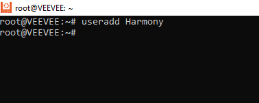
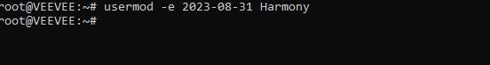
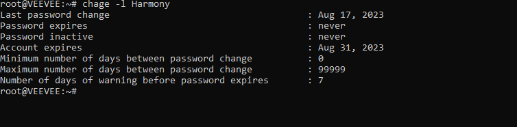
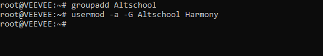
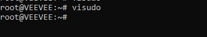
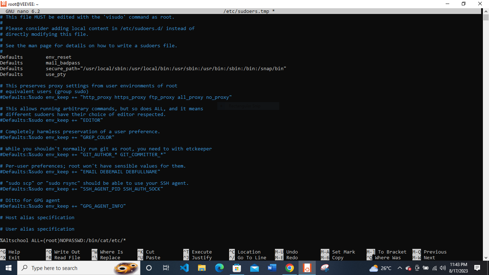
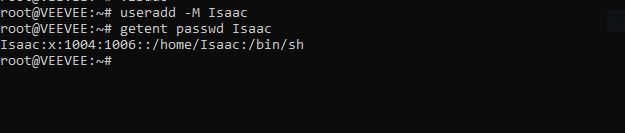

Step 1 explains how to add a user using the 'useradd' command

Step 2 shows how to set the expiry date to 2 weeks and prompt another log in from the user.

Step 3: Change password using the 'chage -l' command

Step 4: Attach user to a group using the '-aG' command

Step 5: visudo

Step 5: Content display

Step 6: To create another user without a home directory using the '-M' and 'getent' command.

